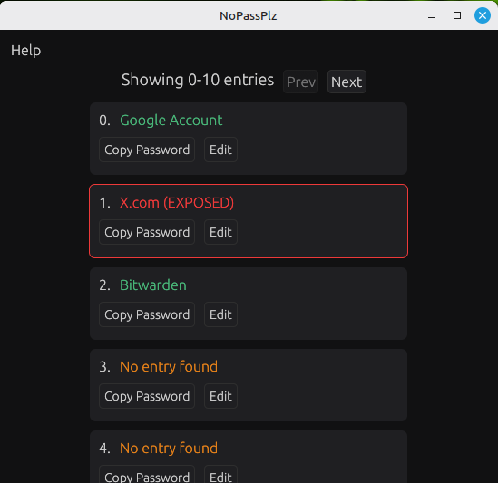

NoPassPlz is a deterministic password generator. Unlike traditional password managers like Bitwarden, your passwords are never stored in the cloud or even locally, they are always derived on-the-fly from your master username and password. Think of it as generating high-entropy passwords from a single set of master credentials.

## This is still WIP I may introduce breaking changes in the future.

## How It Works

Given your master username and password, we first compute a seed using the Argon2id key derivation function (KDF) with these default parameters:
- **Salt**: SHA3-512 hash of the username
- **Memory cost**: 8192 MB
- **Iterations**: 8
- **Parallelism**: 1
- **Output length**: 64 bytes

As of 2025 the estimated computation time for these parameters is about 1 min and 11 seconds. (For most consumer hardware, give or take a couple of seconds)

For each password, we then derive it using HMAC-SHA3-512:
- The Argon2id output is used as the HMAC key.
- A user-selected index (a simple integer, like 0, 1, 2...) is the message.
- The result is a 512-bit (64-byte) hash, encoded as a 128-character hexadecimal string.

This allows to derive an unlimited number of unique, high-entropy passwords from the same master credentials, all without storing any secrets.

# FAQ

### Can I replace an existing password manager with NoPassPlz?

I wouldn't recommend it for most people, while you can deterministically generate as many passwords as you want because of its stateless nature,
it cannot really function very well as a password manager, but you can use it as a password generator for your most important services.

For example password managers like Bitwarden require a `master password` to unlock your vault, and if you not know it already there is no
way to recover it if you forget it you are locked out of your account. With `NoPassPlz` you can generate a high-entropy password for such use cases and be able to always recover it assuming you don't forget your master `Credentials`.

### Does NoPassPlz store any data?

The only data that is stored locally is the a map of `Index Data` which contains metadata about a password entry on a given index.
This data doesn't expose any secrets and is stored in a file called `NoPassPlz.json` in the same directory as the executable and is completely safe to make backups of it even unecrypted.

### What metadata is stored?
Each entry includes:
- **Title** (string, required): Where the password is used (e.g., "Google Account").
- **Description** (string, optional): Additional notes (e.g., "Main email login").
- **Exposed** (bool, optional): Flag if the password has ever been compromised (e.g., via a breach).

### What if I lose the `NoPassPlz.json` file?

You can still regenerate passwords by manually entering the correct index in the app. You'll just need to remember or rediscover which indexes correspond to which accounts.

### What if I forget my master credentials?

If you forget your master credentials you are never be able to recover your passwords.
It is important to create a username and a password in your mind that not only it's stored anywhere but also
not easy to guess, so you can always recover your passwords.

Some tips:

- Username doesn't necessarily need to be something secret or hard to guess, the most important thing is your password.
- Use a long enough password, at least 20+ characters.
- Do not store your password in any digital or physical form, it's should only be stored in your mind.
- Your master password doesn't have to be a very long sequence of nosense words, you could possible
create your own seed phrase based on something you know but is not publicly available information or easy to guess.